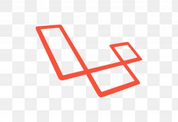

### Hi there :wave::smiley:, I am Naharul.

<h3> 🛠 &nbsp;My Tech Stack</h3>

 
<b>Programming Languages</b>

 
 <a href="https://www.typescriptlang.org/" target="_blank">  
  

	
  
<b>Frontend Development</b>

      

 
<b>Backend Development</b>

 
 </a> 
 <a href="https://laravel.com" target="_blank">  
  

<!--
**Naharul98/Naharul98** is a ✨ _special_ ✨ repository because its `README.md` (this file) appears on your GitHub profile.

Here are some ideas to get you started:

- 🔭 I’m currently working on ...
- 🌱 I’m currently learning ...
- 👯 I’m looking to collaborate on ...
- 🤔 I’m looking for help with ...
- 💬 Ask me about ...
- 📫 How to reach me: ...
- 😄 Pronouns: ...
- ⚡ Fun fact: ...
-->
